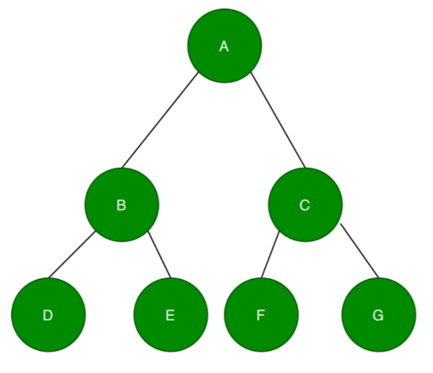

# csci241-lab6
Tree Cardio. Recursive tree methods.

For this lab, we'll use the same definition of a tree node..

public class TreeNode {
    public int value;
    TreeNode left;
    TreeNode right;
    …
}

Subtree

Write a static function public boolean isSubtree(TreeNode t1, TreeNode t2) that returns true if t2 is a subtree of t1, or false otherwise, that is, if there is  a tree in t1 where all the values and descendants of t2 are found.
Full Tree

Write a static function public boolean isFull(TreeNode t) that returns true if t is a full tree.  A full tree is one where the nodes at all levels are completely filled. 

 

The example below shows a full tree.

 

The example below shows a tree that is not full.

image.png
Complete Tree

Write a static function public boolean isComplete(TreeNode t) that returns true if t is a complete tree.  A complete binary tree is one where the nodes at all levels are completely filled, except for the last level, which might not be completely filled. At the last level, the nodes are filled from the left.

 

The example below shows a complete tree.

image.png

 

Optionally there is starter code with some prewritten test cases named TreeNode.java. In order to see the tests run, you'll need to use the "enable assertions" flag like so: `java -ea TreeNode`
